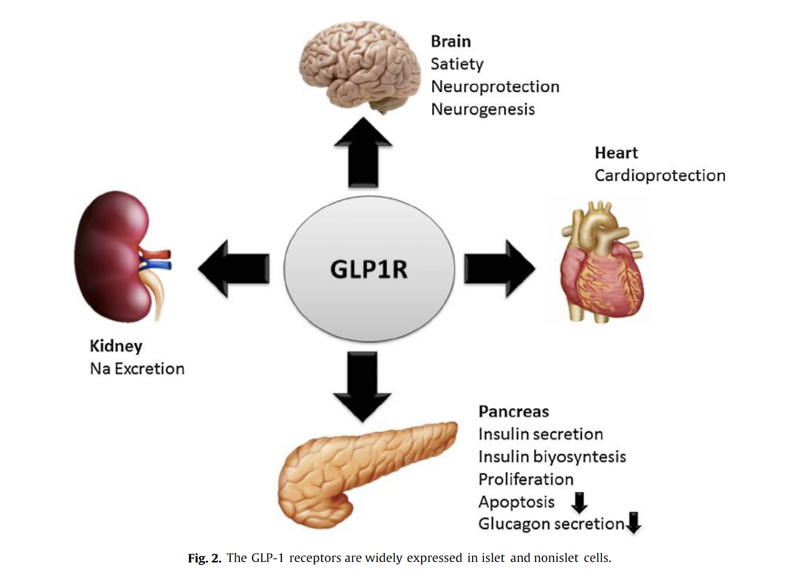
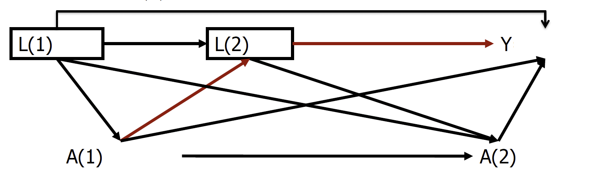

```{r setup, include=FALSE}
library(knitr)
# knitr::opts_chunk$set(echo = FALSE)
library(dplyr)
opts_chunk$set(echo = FALSE,
               out.width = "75%", 
               fig.align = "center")
```


## Motivation

- Type 2 diabetes mellitus (T2DM) is a cardiometabolic disease affecting over 6% of the global population, and 15-20% of the global population of those over the age of 50 as of 2017 (and trending upward) (Khan et al. 2020; Lin et al. 2020)
- Increasing evidence has linked T2DM to dementia (Campbell et al. 2018; Huang 2016)
- Control of diabetes is generally addressed using first-line medications (namely metformin), but second-line regimes (such as GLP-1 receptor agonists/GLP-1RA or SGLT2 inhibitors) are increasingly used as well 
- There is substantial evidence that diabetes medication, including second line regimes like GLP-1, can decrease dementia risk (Duarte et al. 2013; Wu et al. 2020)

## Motivation

- GLP-1RAs are a relatively new treatment for diabetes; some forms have been ion the market since 2005, others as recently as 2013 (White 2015)
- There is reason to believe that GLP-1 is particularly neuroprotective (Duarte et al. 2013), but most studies have been associational and have not compared head-to-head with other second-line regimes; causal analysis is warranted
<!-- ## Causal mechanism -->

```{r image1, out.width="60%", out.height="50%"}

```

## Causal question

What is the effect of cumulative exposure to GLP-1RAs vs. active comparator (other second line, SLGT2i) on dementia?


## Structural causal model (the point-treatment case)

```{r, out.width="90%", out.height="80%"}
include_graphics(c("ggdag1.png"))
```

## Structural causal model (the longitudinal case)

```{r, out.width="90%", out.height="80%"}
include_graphics(c("ggdag2.png"))
```

## Structural causal model

::: columns
:::: column

$$O = (L_0, A_0, ..., A_t, L_t, Y_t)  \approx P_0 $$

Where $t = 1,...,9$ in 6-month follow-up intervals

$A_t$ \= exposure to GLP-1RAs at time t

$Y_t$ \= onset of dementia at time t


::::
:::: column

$L_t$ \=
\begin{itemize}
  \item Age (time-constant)
  \item Sex (time-constant)
  \item Renal disease onset at time t (time-varying)
  \item Obesity status at time t (time-varying)
  \item Time-varying blood glucose (time-varying)
  \item Time-varying cholesterol (time-varying)
\end{itemize}

::::
:::

## Target trial and counterfactual

In our ideal experiment we would enroll T2DM patients who are:

- over 40 years old;
- have least five years on a first-line treatment;
- are beginning a second line treatment (namely GLP-1 or SGLT2i) for the first time.

Causal quantity:

$Y_{\bar{a}} = f_Y(\bar{L}(t),\bar{a}(t), U_{Y})$, where $\bar{a} \in {0,1}$ and denotes the counterfactual exposure history.

## Intervention on the SCM

How would expected dementia risk have differed if all subjects had used GLP-1RAs throughout follow up vs. if they used SLGT2i throughout follow up?

$$ E(Y_{\bar{a}=1}-Y_{\bar{a}=0}) $$

## Observed data and link to causal model

We will emulate our target trial using observational data from an expansive cohort of over 42,000 Danish diabetes patients beginning a second-line regime after 2015.

```{r}
include_graphics(c("consort.png"))
```


Due to Danish registry access issues, for the purposes of this analysis we used simulated data.

## Simulations

- We simulated the data by drawing samples from the discrete multivariate probability distributions of our X variables from Danish Registry summary statistics
- Exposure and time-varying confounder data were aggregated into discrete classes for simplicity and data privacy
- Other univariate distributions were known but not included in the current analysis because without the multivariate distribution that includes other X variables, these variables would only add noise to the estimation

```{r, echo=F, include=F}
library(dplyr)
data <- rio::import("../simulated data/novo_registry_simulated.RDS")
names(data)
table(data$age)
data$age<- factor(data$age,labels=c("41-50","51-60","61-70","71-80","81-90"))
table(data$age)
table(data$sex)
data$sex<- factor(data$sex,labels=c("Male","Female"))
table(data$dementia, data$T3)

subset <- data %>% select(age,sex,kidney_1,obese_1,T1)
subset <- data.frame(apply(subset, 2,function(x) factor(x)))
names(subset) <- c("any_dementia","Age","Sex","BL kidney disease","BL obesity","GLP1 Use" )
table1 <- print(tableone::CreateTableOne(data=subset,vars=c("Age","Sex","BL kidney disease","BL obesity"),strata= "GLP1 Use"))

table1 <- table1[,1:3]
```

## Table 1: Baseline covariates by baseline GLP-1 use in simulated data

```{r, out.width="60%", out.height="60%"}
kableExtra::kbl((table1))
```


## A review of the statistical model and estimand (point treatment)

Target parameter is the average treatment effect (ATE):

$$\Psi(P_0) = E_W[E_0(Y|A=1,W) - E(Y|A=0,W)]$$

Under the randomization and positivity assumptions, one way to estimate this is through the G-Computation formula:
$$\hat{\Psi}(P_n) = E(Y_a) = \sum_w E_0(Y|A=a,W=w)P_0(W=w)$$

<!-- 1)  Estimate $E(Y|A,W) \equiv \bar{Q}^0_n(A,W)$ -->
<!-- 2)  Estimate the treatment mechanism $g_0(A|W)$ and clever covariate $H_n(A,W)$ -->
<!-- 3)  Modify initial estimate with clever covariate -->
<!-- 4)  Calculate counterfactual outcomes under treatment -->
<!-- 5)  Take empirical mean -->
<!-- $$ $$ -->

## The longitudinal case

Time-dependent confounding complicates our ability to estimate the ATE

```{r}

```
- if we adjust for L naively, we lose the effect of A(1) through L(2), we can't stratify on descendants of A

...what to do?

## Statistical model and estimand for longitudinal data

We want to estimate the ATE of the counterfactual treatment histories ($\bar{a}$) of continuously exposed to GLP-1 ($\bar{a}=1$) and continously exposed to SGLT2i ($\bar{a}=0$):

$$ E(Y_{\bar{a}=1}-Y_{\bar{a}=0}) $$


To account for the time-dependent nature of the confounding variables, we used longitudinal estimators.

## Longitudinal conterfactual estimators

In longitudinal target parameters, we must evaluate them such that we do not condition on descendants of our treatment node.

In the case of G-Comp, one way to side step this is through a series of conditional expectations:

$$E_{P\bar{a}}(Y_{\bar{a}}) = E(E(...E(E(Y_{\bar{a}}|\bar{L}_{\bar{a}}(K))|\bar{L}_{\bar{a}}(K-1))...|L(1)))$$

Where $$\bar{L}_{\bar{a}} \equiv \bar{L}(K),\bar{A}(K)$$
<!-- (One way to estimate these is through sequential regression.) -->

## Longitudinal conterfactual estimators

I don't know about you, but for it was helpful to look at a two time-unit example:

$$E( E( E(Y|A(2)=1,A(1)=1,L(2),L(1))|A(1)=1,L(1)))$$

Summing over the covariate distributions...
\small
$$\sum_{l(1)}  \left[ \sum_{l(2)}E(Y|\bar{L}=\bar{l},\bar{A}=1)P(L(2)=l(2)|A(1)=1,L(1)=l(1)\right]P(L(1)=l(1))$$
\normalsize

<!-- 1)  Estimate $E(Y|A,W) \equiv \bar{Q}^0_n(A,W)$ -->
<!-- 2)  Estimate the treatment mechanism $g_0(A|W)$ and clever covariate $H_n(A,W)$ -->
<!-- 3)  Modify initial estimate with clever covariate -->
<!-- 4)  Calculate counterfactual outcomes under treatment -->
<!-- 5)  Take empirical mean -->

## A note on identifiability in longitudinal data

- In longitudinal analyses, time-dependent confounding makes identifiability more complicated.

We must assess independence sequentially:
$$
Y_{\bar{a}} \perp \!\!\! \perp A(t) | \bar{L}(t), \bar{A}(t-1)
$$

This is called the sequential randomization assumption, analog to the point-treatment randomization assumption, which we will assume is met for the purpose of this analysis.


## Analysis

After smoothing over 6-month gaps of GLP-1 and SGLT2i exposure, we constrasted dementia outcomes between T2DM patients with continuous GLP-1 exposure and T2DM patients with continuous SGLT2i exposure.

We used the l-TMLE package to estimate the target parameters of interest (GComp, IPTW, TMLE).

For the purposes of the project we used a simplified SuperLearner list that included only SL.mean, SL.glm, SL.glmnet.


## Preliminary results

```{r, echo=F,include=T, out.width="90%", out.height="75%"}

include_graphics(c("forestplot.png"))

```

## Preliminary results

- We found a 0.15% (95% CI -0.23%, -0.01%) decrease in the risk of disease among GLP-1 users compared to SGLT2i users

- Under sequential randomization and positivity assumptions, we can interpret this result causally: 

*The risk of dementia was 0.15% lower under an intervention in which all diabetes patients used GLP-1RAs, compared to an intervention in which they all used SGLT2i.*


## Causal assumptions in context

- Unfortunately, our ability to causally interpret the parameter is weakened by the unmeasured confounding. 
- We have limited access to vital sign and lab data on only a subsample of Danish regions, which may lead to time-dependent confounding by time-varying blood glucose (or other relevant biomarkers such as cholesterol or blood pressure).
- We will address this in future by performing sensivitiy analyses restricting to areas in which biomarker data is available.

## Discussion

- In our simulated data set with a limited covariate set, we found small but significant differences in dementia risk between GLP-1 users and SGLT2i users
- While the effect is small, in the context of the population of over 217,000 diabetes patients; an intervention on the population would prevent 325 cases of dementia
- Further analysis will be needed, including replication on the actual registry data

## Future directions

This is an admittedly limited first analysis, and we plan to expand by:

- Improving candidate learners
- Examining additional second line treatments (eg. DPP4)
- Allowing for dynamic treatment regimes
- Using continuous time TMLE
- Testing for robustness of the estimate across repeated simulations of the data
- Examining additional outcomes (death, cardiovascular disease)
- Running on the real data!

## Acknowledgements

This (ongoing) analysis is part of a broader collaboration with Novo Nordisk and the University of Copenhagen to advance best practices for applying causal inference methods to real world health datasets in order to improve patient care.

Thank you to Andrew Mertens (UC Berkeley) for his help with the data simulations and his feedback on this presentation, and to Thomas Gerds (University of Copenhagen) for the descriptive statistics used in the simulations. And to the rest of the study team, including (but certainly not limited to):

- Mark van der Laan, Maya Petersen (UC Berkeley)
- Theis Lange, Helene Rytgaard (University of Copenhagen)
- Kajsa Kvist, Trine Abrahamsen (Novo Nordisk)


## References (1)
\small
Petersen, M. Advanced Causal Inference PH252E. Lecture 3: Causal Models and Counterfactuals. UC Berkeley (2018).

Petersen, M. Advanced Causal Inference PH252E. Lecture 7: Sequential Regression G Computation Estimator; Longitduinal TMLE. UC Berkeley (2018).

Campbell JM, Stephenson MD, Courten BD, Chapman I, Bellman SM,
Aromataris E. Metformin use associated with reduced risk of dementia
in patients with diabetes: a systematic review and meta-analysis. J
Alzheimers Dis. 2018;65:1225-1236

Duarte, A. I., et al. "Crosstalk between diabetes and brain: glucagon-like peptide-1 mimetics as a promising therapy against neurodegeneration." Biochimica et Biophysica Acta (BBA)-Molecular Basis of Disease 1832.4 (2013): 527-541.

Huang ES. Management of diabetes mellitus in older people with comorbidities. BMJ 2016; 353: i2200.

## Reference (2)
\small
Khan MAB, Hashim MJ, King JK, Govender RD, Mustafa H, Al Kaabi J. Epidemiology of Type 2 Diabetes - Global Burden of Disease and Forecasted Trends. J Epidemiol Glob Health. 2020 Mar;10(1):107-111. doi: 10.2991/jegh.k.191028.001. PMID: 32175717; PMCID: PMC7310804.

Lin, X., Xu, Y., Pan, X. et al. Global, regional, and national burden and trend of diabetes in 195 countries and territories: an analysis from 1990 to 2025. Sci Rep 10, 14790 (2020). https://doi.org/10.1038/s41598-020-71908-9

White, John R. "A brief history of the development of diabetes medications." Diabetes Spectrum 27.2 (2014): 82-86.

Wu, Che‐Yuan, et al. "Relationships between memory decline and the use of metformin or DPP4 inhibitors in people with type 2 diabetes with normal cognition or Alzheimer's disease, and the role APOE carrier status." Alzheimer's & Dementia 16.12 (2020): 1663-1673.
<!-- ```{r, echo=F} -->
<!-- library(dagitty) -->
<!-- library(ggdag) -->

<!-- dag <- dagitty( -->
<!--  'dag { -->
<!-- "A" [exposure,pos="-1.759,0.423"] -->
<!-- "W" [latent,pos="0.108,1.017"] -->
<!-- "U" [latent,pos="0,1.595"] -->
<!-- "Y" [outcome,pos="1.258,0.409"] -->

<!-- "A" -> "Y" -->
<!-- "W" -> "A" -->
<!-- "W" -> "Y" -->
<!-- "U" -> "A" -->
<!-- "U" -> "Y" -->
<!-- "U" -> "W" -->

<!-- } -->
<!--  ' -->
<!-- ) -->
<!--  exposures(dag) <- c("A") -->
<!-- outcomes(dag) <- c("Y") -->
<!-- tidy_dag <- tidy_dagitty(dag) -->
<!--  (finaldag <- ggdag(tidy_dag)+theme_dag() ) -->
<!--  ggsave(finaldag, file="./ggdag1.png") -->


```{r, echo=F,eval=F}
# # make DAG by specifying dependence structure
dag <- dagitty(
 'dag {
"A(0)" [exposure,pos="-1.286,0.466"]
"A(1)" [exposure,pos="-0.395,0.466"]
"A(t)" [exposure,pos="0.573,0.423"]
"L(0)" [pos="-1.950,0.239"]
"L(1)" [pos="-0.899,-0.045"]
"L(t)" [pos="-0.014,-0.045"]
"U(0)" [latent,pos="-1.759,1.595"]
"U(1)" [latent,pos="-0.652,1.610"]
"U(t)" [latent,pos="0.408,1.617"]
"Y(t)" [outcome,pos="1.258,0.409"]
"A(0)" -> "A(1)"
"A(0)" -> "L(1)"
"A(0)" -> "U(1)"
"A(1)" -> "A(t)"
"A(1)" -> "L(t)"
"A(1)" -> "U(t)"
"A(t)" -> "Y(t)"
"L(0)" -> "A(0)"
"L(0)" -> "L(1)"
"L(1)" -> "A(1)"
"L(1)" -> "L(t)"
"L(t)" -> "A(t)"
"U(0)" -> "A(0)"
"U(0)" -> "L(0)"
"U(0)" -> "U(1)"
"U(1)" -> "A(1)"
"U(1)" -> "L(1)"
"U(1)" -> "U(t)"
"U(t)" -> "A(t)"
"U(t)" -> "L(t)"
"U(t)" -> "Y(t)"
}
 '
)
# exposures(dag) <- c("A")
# outcomes(dag) <- c("Y")
tidy_dag <- tidy_dagitty(dag)
 (finaldag <- ggdag(tidy_dag)+theme_dag() )
 ggsave(finaldag, file="./ggdag2.png")
```


